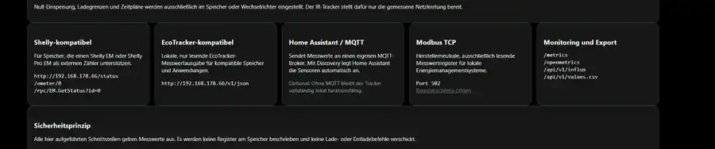

# IR Tracker Offline — 2.1.1

**Deutsch** | [English](#english)

Lokale, cloudfreie Firmware für einen **ESP32-C3-basierten IR-Stromzähler-Tracker**. Der Tracker liest SML-/OBIS- sowie IEC-62056-21/D0-Daten direkt am Stromzähler aus, bereitet sie lokal auf und stellt sie über Weboberfläche und offene lokale Schnittstellen bereit — ohne Cloud-Zwang und ohne externen Server.

Erstellt und gepflegt von **Michael Roßmann**.

> Unabhängiges Community-Projekt. Nicht mit Solakon, Shelly, EcoTracker oder anderen genannten Herstellern verbunden und nicht von diesen unterstützt. Markennamen werden ausschließlich zur Beschreibung kompatibler lokaler Schnittstellen verwendet.

## Was der IR Tracker kann

- **lokale Zählerauswertung:** SML, OBIS und IEC 62056-21/D0
- **Live-Messwerte:** Gesamtleistung, Netzbezug, Einspeisung sowie — soweit vom Zähler geliefert — L1/L2/L3
- **lokale Weboberfläche:** Dashboard, Verlauf, Einstellungen, Schnittstellen und Wartung direkt auf dem ESP32-C3
- **Compact-History:** mehrstufig verdichtete Langzeithistorie ohne externen Datenbankserver
- **offene lokale API:** bevorzugte neutrale Schnittstelle unter `/api/v1/meter`
- **Home Assistant / MQTT:** inklusive MQTT Discovery
- **Monitoring und Export:** CSV, Prometheus/OpenMetrics und Influx Line Protocol
- **Modbus TCP:** optionale, ausschließlich lesende Messwertschnittstelle
- **Kompatibilitätsendpunkte:** read-only Shelly- und EcoTracker-kompatible lokale Endpunkte
- **Netzwerk:** bis zu drei WLANs, Setup-Hotspot als Rückfall sowie optionale W5500-LAN-Unterstützung mit WLAN-Fallback
- **Updates:** signierte vollständige `.irup`-Pakete für Firmware und Weboberfläche
- **Recovery und Diagnose:** Wiederherstellungsoberfläche, Einstellungs-/History-Backup und geschützte Diagnosefunktionen

> **Wichtig:** Der IR Tracker misst und veröffentlicht Werte. Nulleinspeisung, Ladegrenzen, Zeitpläne sowie Lade-/Entladebefehle werden nicht vom Tracker gesteuert, sondern im Speicher, Wechselrichter, der Wallbox oder einer Automatisierung eingestellt.

## Lokale Architektur

```text
Digitaler Stromzähler
        │ IR
        ▼
   IR Tracker
        │
        ├── Weboberfläche / Compact-History
        ├── HTTP API / CSV / Prometheus / Influx
        ├── MQTT / Home Assistant Discovery
        ├── Modbus TCP (read-only)
        ├── Shelly-kompatible Endpunkte (read-only)
        └── EcoTracker-kompatible Endpunkte (read-only)

        WLAN oder optional W5500-LAN
```

Es ist kein Cloudkonto erforderlich. Der normale Betrieb bleibt auch ohne MQTT, Home Assistant oder Internetverbindung lokal funktionsfähig.

## Weboberfläche

Die Weboberfläche läuft vollständig lokal auf dem Tracker. Sie zeigt Live-Leistung und Phasenwerte, Energieübersichten, historische Verläufe, Datenlücken sowie die verfügbaren lokalen Schnittstellen. Für die Anzeige ist weder ein Cloudkonto noch ein externer Webserver erforderlich.

### Verlauf und Messdetails


Datenlücken bzw. Ausfälle werden im Verlauf sichtbar markiert. Beim Überfahren mit der Maus oder Antippen eines Messpunkts werden die zugehörigen Messwerte angezeigt.


### Lokale Schnittstellen



> Die Screenshots zeigen reale lokale Messwerte eines Testsystems. Werte, Zeiträume und verfügbare Phasen hängen vom jeweiligen Stromzähler ab.

## Schnittstellen auf einen Blick

| Schnittstelle | Zweck | Verhalten |
| --- | --- | --- |
| `/api/v1/meter` | stabile, herstellerneutrale Messwert-API | read-only |
| `/api/v1/status` | ausführlicher Laufzeit-/Diagnosestatus | read-only |
| MQTT | Messwerte und Home Assistant Discovery | Ausgabe |
| Modbus TCP, Port 502 | lokale Energiemanagementsysteme | read-only |
| Shelly-kompatibel | lokale Speicher/Integrationen mit Shelly-EM-/Pro-EM-Unterstützung | read-only |
| EcoTracker-kompatibel | lokale EcoTracker-kompatible Messwertabfrage | read-only |
| `/metrics`, `/openmetrics` | Monitoring | read-only |
| `/api/v1/influx` | Influx Line Protocol | read-only |
| `/api/v1/values.csv` | CSV-Export | read-only |

Für neue Integrationen sollte nach Möglichkeit `/api/v1/meter` verwendet werden. Details stehen unter [Schnittstellen](docs/INTERFACES.md), [HTTP-API](docs/API.md) und [Modbus TCP](docs/MODBUS.md).

## Hardware

Aktueller Firmware-Referenzstand:

- ESP32-C3
- PlatformIO-Board `esp32-c3-devkitm-1`
- 4 MB Flash
- DIO-Flashmodus
- native USB-CDC-Unterstützung
- optional W5500 Ethernet

Die Universal-Firmware enthält W5500-LAN mit WLAN-Fallback. In 2.1.1 läuft der W5500 mit 30 MHz SPI; bei nicht erkanntem Ethernet wird der SPI-Bus wieder freigegeben, damit WLAN-only-Hardware ihre GPIOs weiter nutzen kann.

## Neu in 2.1.1

Version 2.1.1 baut auf der Compact-History von 2.0.0 auf und verbessert vor allem Inbetriebnahme, Diagnose, Netzwerk und Update-Zuverlässigkeit:

- automatische Zähler-Inbetriebnahme mit mehreren seriellen Kandidaten unter Wiederverwendung der bestehenden SML-/D0-Parser
- Safe-Recovery nach wiederholten frühen Panic-/Watchdog-/Brownout-Starts
- Mess- und History-Service auch während des eigentlichen HTTP-OTA-Uploads
- Captive-Portal-Erkennung für den Setup-Hotspot auf Android, iOS/macOS und Windows
- gemeinsames Admin-Konto für LAN und WLAN; das aktuell wirksame Admin-Passwort wird in den geschützten Einstellungen 1:1 angezeigt
- neue Admin-Passwörter: 6–64 Zeichen; WPA2-Setup-Hotspot weiterhin technisch mindestens 8 Zeichen
- W5500 mit 30 MHz SPI als stabiler Durchsatz-/Signalintegritäts-Kompromiss
- erweiterte geführte Diagnose, Produktstatus und datensparsamer Supportbericht
- zusätzlicher isolierter NVS-Schreib-/Lesetest im Factory-Test
- klarere Modultrennung für Product Runtime, Product Safety, Product Experience, Runtime Health und automatische Zählererkennung

Die vollständige Liste steht in den [Release Notes 2.1.1](release/RELEASE_NOTES-2.1.1.md).

## Update auf 2.1.1

Vor dem Upgrade Einstellungen und vollständige History sichern.

1. `ir-tracker-update-2.1.1.irup` unter **Wartung → Vollständiges Update** installieren.
2. Neustart abwarten und Messung, Weboberfläche und Asset-Version prüfen.
3. Geräte, die bereits erfolgreich auf 2.0.0 Compact-History migriert wurden, benötigen normalerweise nur dieses vollständige 2.1.1-IRUP.
4. Bei einem direkten Sprung von einer älteren, noch nicht migrierten Version gelten weiterhin die 2.0.0-Schutzregeln: beide validierten App-Slots müssen einen kompatiblen Reader enthalten, bevor die History-Migration starten darf.
5. Ein Mischstand aus Firmware 2.1.1 und Webassets 2.0.0 ist kein vollständiger 2.1.1-Releasezustand; in diesem Fall das vollständige 2.1.1-IRUP erneut installieren.

WLAN-Updates verändern die Partitionstabelle nicht. `.irup` niemals in `.irfw` umbenennen.

Die vollständigen Hinweise stehen in den [Release Notes 2.1.1](release/RELEASE_NOTES-2.1.1.md) und unter [Installation](docs/INSTALLATION.md).

## Erster Zugang

Nach einer frischen Installation startet der Tracker das WLAN `IR-Tracker-Setup-XXXX`. Zugangsdaten, USB-Installation und Recovery-Schritte sind unter [Installation](docs/INSTALLATION.md) dokumentiert.

Die Weboberfläche verwendet HTTP und gehört ausschließlich in ein vertrauenswürdiges Heimnetz oder getrenntes IoT-Netz. **Keine Ports aus dem Internet direkt auf den Tracker weiterleiten.** Für Fernzugriff sollte ein VPN verwendet werden.

## Dokumentation

- [Installation und Wiederherstellung](docs/INSTALLATION.md)
- [Release Notes 2.1.1](release/RELEASE_NOTES-2.1.1.md)
- [Release Notes 2.0.0](release/RELEASE_NOTES-2.0.0.md)
- [HTTP-API](docs/API.md)
- [Schnittstellen](docs/INTERFACES.md)
- [Modbus TCP](docs/MODBUS.md)
- [Zähler-Kompatibilität](docs/compatibility/README.md)
- [Firmware-Architektur](docs/ARCHITECTURE.md)
- [Webasset-Partition](docs/ASSET_PARTITION.md)
- [USB-Umschaltung](docs/USB_SWITCHING.md)
- [Hardwaretest](docs/HARDWARE_TEST.md)
- [Dauertest](docs/SOAK_TEST.md)
- [Release-Prüfliste](docs/RELEASE_CHECKLIST.md)
- [Security](.github/SECURITY.md)
- [Rechteprüfung](docs/legal/RIGHTS_REVIEW.md)
- [Markenhinweis](docs/legal/TRADEMARKS.md)
- [Drittsoftware](docs/legal/THIRD_PARTY_NOTICES.md)

## Projektstatus

**2.1.1 ist der dokumentierte aktuelle Stand.** Die Änderungen gegenüber 2.0.0 sind in den [Release Notes 2.1.1](release/RELEASE_NOTES-2.1.1.md) vollständig zusammengefasst. Die 2.0.0-Dokumentation bleibt für Compact-History-Migration und ältere Upgradepfade erhalten.

## Lizenz

Copyright © 2026 Michael Roßmann. Lizenz: **PolyForm Noncommercial 1.0.0**. Private und sonstige nichtkommerzielle Nutzung ist gemäß Lizenz erlaubt; gewerbliche Nutzung ist nicht gestattet. Verbindlich sind [LICENSE.md](LICENSE.md), [AUTHORS.md](AUTHORS.md), [RIGHTS_REVIEW.md](docs/legal/RIGHTS_REVIEW.md) und [TRADEMARKS.md](docs/legal/TRADEMARKS.md).

---

<a id="english"></a>

## English

IR Tracker Offline is local, cloud-free firmware for an **ESP32-C3 based infrared electricity-meter tracker**. SML/OBIS and IEC 62056-21/D0 data are processed directly on the device and exposed through a local web UI and open local interfaces without requiring a cloud account or external server.

Maintained by **Michael Roßmann**. This is an independent community project and is not affiliated with or supported by Solakon, Shelly, EcoTracker, or other vendors named for compatibility purposes.

### Core features

- local SML/OBIS and IEC 62056-21/D0 meter parsing
- live power, grid import/export and optional L1/L2/L3 values
- local web UI and Compact History
- vendor-neutral `/api/v1/meter` HTTP API
- Home Assistant MQTT Discovery
- CSV, Prometheus/OpenMetrics and Influx Line Protocol
- optional read-only Modbus TCP
- read-only Shelly-/EcoTracker-compatible endpoints
- up to three Wi-Fi profiles plus setup fallback AP
- optional W5500 Ethernet with Wi-Fi fallback
- signed complete `.irup` firmware + web-asset updates
- recovery UI, settings/history backup and protected diagnostics

Compatibility refers only to implemented local API/network behavior. IR Tracker keeps its own neutral identity and does not impersonate third-party devices.

### Web UI

The browser UI runs entirely on the tracker and provides live values, energy summaries, history including visible data gaps, and an overview of the local interfaces. See the [Web UI screenshots](#weboberfläche) above.

### Version 2.1.1

2.1.1 builds on the 2.0.0 Compact History foundation and focuses on commissioning, diagnostics, networking and update reliability. It adds conservative automatic meter commissioning, Safe Recovery after repeated early crash-like boots, meter/history servicing during HTTP OTA uploads, captive-portal setup support, a shared LAN/Wi-Fi administrator account with the currently effective password visible in protected Settings, 30 MHz W5500 SPI, guided diagnostics, a privacy-reduced support report, and an isolated NVS factory test.

See the complete [2.1.1 Release Notes](release/RELEASE_NOTES-2.1.1.md) for all changes and compatibility details.

### Interfaces and documentation

New integrations should prefer `/api/v1/meter`; `/api/v1/status` is the larger runtime/diagnostic object. The tracker acts as a read-only electricity-meter gateway: battery/inverter control remains outside the normal integration contract.

See [HTTP API](docs/API.md), [Interfaces](docs/INTERFACES.md), [Modbus](docs/MODBUS.md), [Architecture](docs/ARCHITECTURE.md), [Asset partition](docs/ASSET_PARTITION.md), [Compatibility](docs/compatibility/README.md), [Security](.github/SECURITY.md), the [2.1.1 Release Notes](release/RELEASE_NOTES-2.1.1.md), and the historical [2.0.0 Release Notes](release/RELEASE_NOTES-2.0.0.md).

## License

Copyright © 2026 Michael Roßmann. Licensed under **PolyForm Noncommercial 1.0.0**. See [LICENSE.md](LICENSE.md) and the legal documentation for binding terms.
